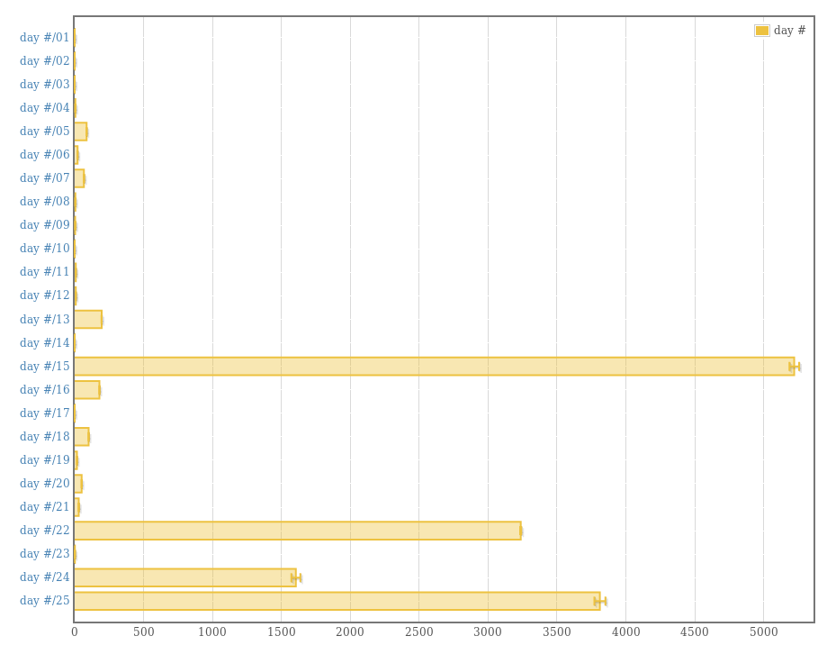

# advent-of-haskell

Advent of code in Haskell lts-10.4

Remember that benchmarks aren't perfect, and can vary between runs for a variety
of reasons. I use them to see which days I need to optimize (pretty obvious),
not gather absolute data on.

    Slowest (in seconds):

    - Day 15 11.5
    - Day 22 10.4
    - Day 25 10
    - Day 24  3.4
    - All others finish under a second

